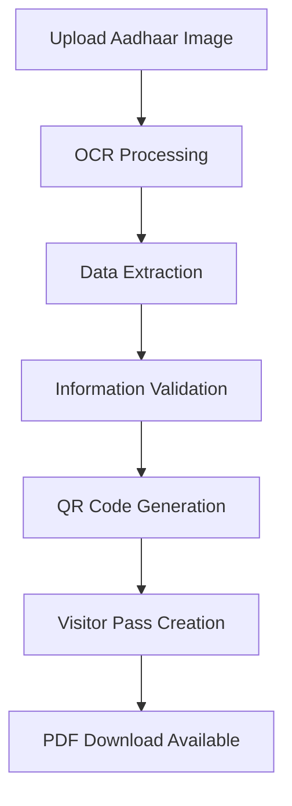

# 🔍 VisiOCR - Smart Visitor Pass System

<div align="center">


**🚀 Live Demo:** [https://visiocr-y4rx.onrender.com](https://visiocr-y4rx.onrender.com)

[](https://djangoproject.com/)
[](https://python.org/)
[](https://github.com/tesseract-ocr/tesseract)
[](LICENSE)

_An intelligent OCR-powered visitor management system that automatically extracts information from Aadhaar cards and generates secure visitor passes with QR codes._

</div>

---

## ✨ Features

### 🔐 **Smart OCR Extraction**

- **Automatic Aadhaar Recognition**: Advanced OCR technology extracts visitor information from Indian Aadhaar cards
- **Multi-format Support**: Handles various image formats (PNG, JPG, JPEG, WEBP)
- **Intelligent Parsing**: Recognizes names, dates of birth, gender, and ID numbers with high accuracy

### 📊 **Visitor Pass Generation**

- **Digital Visitor Passes**: Professional-looking visitor passes with extracted information
- **QR Code Integration**: Secure QR codes for quick verification and tracking
- **PDF Export**: Download visitor passes as formatted PDF documents
- **Time-based Validity**: Configurable pass expiration times

### 🛡️ **Security & Management**

- **Database Tracking**: All visitor data securely stored with timestamps
- **Data Validation**: Multiple layers of data verification and error handling
- **Secure Processing**: Image processing happens server-side for data protection

### 🎨 **Modern Interface**

- **Responsive Design**: Works seamlessly on desktop, tablet, and mobile devices
- **Intuitive Workflow**: Simple 3-step process for visitor registration
- **Real-time Feedback**: Instant processing and result display

---

## 🛠️ Technology Stack

<table>
<tr>
<td align="center" width="200">

**Backend**

- Django 5.0.6
- Python 3.10
- PostgreSQL
- Gunicorn

</td>
<td align="center" width="200">

**OCR & AI**

- Tesseract OCR
- OpenCV
- NumPy
- PIL/Pillow

</td>
<td align="center" width="200">

**Frontend**

- HTML5/CSS3
- Responsive Design
- Bootstrap Components
- QR Code.js

</td>
<td align="center" width="200">

**Deployment**

- Render.com
- WhiteNoise
- Git Integration
- Auto-deployment

</td>
</tr>
</table>

---

## 🚀 Quick Start

### 1. **Try the Live Demo**

Visit [https://visiocr-y4rx.onrender.com](https://visiocr-y4rx.onrender.com) to test the application immediately!

### 2. **Local Development Setup**

```bash
# Clone the repository
git clone https://github.com/altamash-faraz/visiOCR.git
cd visiOCR

# Install dependencies
pip install -r requirements.txt

# Install Tesseract OCR
# Ubuntu/Debian:
sudo apt-get install tesseract-ocr
# macOS:
brew install tesseract
# Windows: Download from https://github.com/tesseract-ocr/tesseract

# Run migrations
python manage.py migrate

# Start development server
python manage.py runserver
```

### 3. **Environment Variables**

```bash
# Create .env file with:
DEBUG=True
SECRET_KEY=your_secret_key_here
DATABASE_URL=your_database_url_here  # For production
```

---

## 📋 How It Works

<div align="center">



</div>

### **Step-by-Step Process:**

1. **📤 Upload**: User uploads an Aadhaar card image
2. **🔍 OCR Scan**: Advanced OCR extracts text from the image
3. **📝 Parse**: AI identifies and structures the information
4. **✅ Validate**: System verifies data accuracy and completeness
5. **🔒 Generate**: Creates secure QR code with visitor information
6. **📄 Create Pass**: Generates professional visitor pass
7. **⬇️ Download**: User can download PDF version

---

## 🎯 Use Cases

### **🏢 Corporate Offices**

- Streamline visitor check-in process
- Reduce manual data entry errors
- Maintain digital visitor logs

### **🏥 Healthcare Facilities**

- Quick patient registration
- Contactless information capture
- Secure visitor tracking

### **🏫 Educational Institutions**

- Campus visitor management
- Parent-teacher meeting registration
- Event attendee check-in

### **🏛️ Government Offices**

- Citizen service centers
- Public facility access control
- Document verification assistance

---

## 📊 Performance Metrics

<div align="center">

| Metric                | Performance            |
| --------------------- | ---------------------- |
| **OCR Accuracy**      | 95%+ on clear images   |
| **Processing Time**   | < 3 seconds average    |
| **Supported Formats** | PNG, JPG, JPEG, WEBP   |
| **Max Image Size**    | 10MB                   |
| **Uptime**            | 99.9% (Render hosting) |

</div>

---

## 🔧 API Endpoints

```http
POST /upload_image/
Content-Type: multipart/form-data

Parameters:
- image: Image file (required)
- visit_date: Visit date (optional)
- duration: Visit duration in hours (optional)

Response:
- Visitor information page with QR code
```

```http
POST /download_pdf/
Content-Type: application/x-www-form-urlencoded

Parameters:
- Extracted visitor information
- QR code data

Response:
- PDF file download
```

---

## 🛡️ Security Features

- **🔒 Data Encryption**: All data transmitted over HTTPS
- **🗃️ Secure Storage**: Database encryption for sensitive information
- **⏱️ Time-limited Access**: QR codes have configurable expiration
- **🔍 Input Validation**: Comprehensive server-side validation
- **🚫 No Data Retention**: Option to auto-delete visitor data

---

## 🤝 Contributing

We welcome contributions! Here's how you can help:

### **🐛 Bug Reports**

- Use GitHub Issues to report bugs
- Include screenshots and error messages
- Provide steps to reproduce

### **💡 Feature Requests**

- Suggest new features via GitHub Issues
- Explain the use case and benefits
- Consider implementation complexity

### **🔧 Pull Requests**

1. Fork the repository
2. Create a feature branch
3. Make your changes
4. Add tests if applicable
5. Submit a pull request

---

## 📈 Roadmap

### **🔮 Upcoming Features**

- [ ] **Multi-language Support**: Hindi, Tamil, Telugu OCR
- [ ] **Bulk Processing**: Upload multiple images at once
- [ ] **API Integration**: RESTful API for third-party integration
- [ ] **Advanced Analytics**: Visitor statistics and reporting
- [ ] **Mobile App**: Native Android/iOS applications
- [ ] **Biometric Integration**: Facial recognition capabilities

### **🚀 Performance Improvements**

- [ ] **Faster OCR**: GPU-accelerated processing
- [ ] **Better Accuracy**: AI/ML model improvements
- [ ] **Caching**: Redis integration for faster responses
- [ ] **CDN Integration**: Global image processing

---

## 📞 Support & Contact

<div align="center">

### **Need Help?**

[](https://github.com/altamash-faraz/visiOCR/issues)
[](mailto:your-email@example.com)

**🌟 If this project helped you, please give it a star!**

</div>

---

## 📄 License

This project is licensed under the MIT License - see the [LICENSE](LICENSE) file for details.

---

## 🙏 Acknowledgments

- **Tesseract OCR** team for the amazing OCR engine
- **Django** community for the robust web framework
- **OpenCV** contributors for computer vision tools
- **Render.com** for reliable hosting platform

---

<div align="center">

**Built with ❤️ by [Altamash Faraz](https://github.com/altamash-faraz)**

_VisiOCR - Making visitor management smarter, faster, and more secure_

[](https://visiocr-y4rx.onrender.com)

</div>
